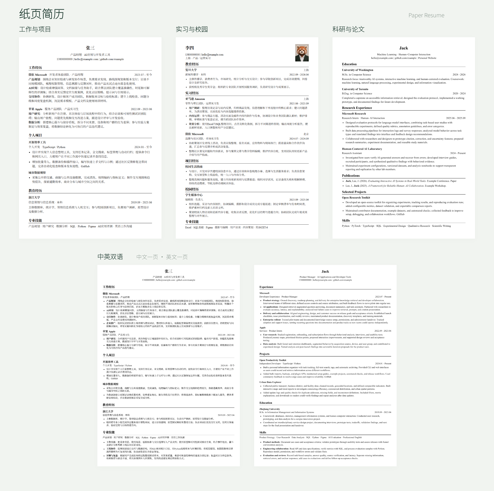

# 纸页简历 / Paper Resume

[English](README.en.md)

纸页简历是在本机运行的简历编辑器。正文用Markdown保存，可以在页面编辑，也可以由Agent通过CLI修改。右侧预览显示实际PDF分页，导出的是同一份PDF。

“纸页”与“职业”（zhiye）谐音，寓意把职业经历整理成一页纸简历。

写简历时，先把经历和成果讲清楚。你可以让正在使用的agent根据内容选择合适的模板，通过CLI完成排版，并在需要时压缩到一页。模板的DIY调整也交给agent处理，把注意力留给内容的取舍和表达。



上图直接由四份PDF页面组合；双语示例保留中文、英文各一页。查看原PDF：[工作与项目](docs/templates/projects.pdf)、[实习与校园](docs/templates/internship.pdf)、[科研与论文](docs/templates/academic.pdf)、[中英双语](docs/templates/bilingual.pdf)。证件照为生成的拟人角色。

## 开始使用

需要Node.js 22.13或更新版本，以及Chrome或Edge。PDF生成和排版测试需要浏览器，基础CLI编辑不需要。

下载或克隆仓库，在项目目录运行：

```sh
npm install
npm start
```

打开[本机页面](http://127.0.0.1:8765/index.html)。不需要账号，服务只监听本机。没有简历时显示模板首页，创建或上传后再保存文档。端口被占用时可换一个：

```sh
node cli.js serve --file resume.paper.json --port 8766
```

Windows和macOS会查找已安装的Chrome或Edge，Linux会尝试常见Chromium路径。非标准路径可以设置环境变量`PAPER_BROWSER_PATH`，或在渲染命令中指定：

```sh
node cli.js render --browser-path "/path/to/chrome" --output output/preview
```

## 页面操作

没有简历时显示首页；有简历时，不带简历ID的链接会恢复上次编辑的简历。编辑页点击品牌或logo返回首页，首页品牌不可点击。启动服务不会自动创建示例简历。

首页提供工作与项目、实习与校园、科研与论文、中英双语四种示例。选模板后，可以从示例开始，或上传已有文件。每次创建都生成独立简历，不会替换上一份。模板是普通Markdown，不限制章节顺序。

上传支持含文字的PDF、DOCX、Markdown、TXT和本工具的JSON文档，上限25MB。旧版`.doc`请先另存为`.docx`。导入后要核对双栏PDF的阅读顺序，以及Word文本框、图片中的文字。工具不提供OCR，扫描件需由Agent识别或自行补充。原文件中的图片不会自动导入。

编辑页左侧是正文，右侧是PDF。一个回车换行，两个回车空一行。选中文字后可点击加粗、斜体、下划线或链接按钮，也可直接写Markdown。图片按钮支持PNG、JPEG、WebP，上限2MB；证件照默认右上角，logo默认左上角。选择logo后可改为具体名称旁的行内位置；不选择时不会自动放到章节标题后面。

“样式设置”调整字体、字号、行距、边距和各层间距。“一键排版”清理多余空行，按内容调整字号与间距；一页以内也会整理留白。超过一页时显示“压成一页”。在字号、边距下限内仍放不下时会提示失败，保留原文，不自动删减经历。

默认名称取正文第一个标题，通常就是姓名。点击顶部名称可重命名，手动改名后保留自定义名称，正文姓名不变。顶部、侧栏、PDF下载使用相同名称。侧栏可切换简历或创建其他版本。

页面自动保存。刷新恢复浏览器草稿；与CLI同时修改发生冲突时，保留草稿并提示处理。PDF首次生成要启动后台浏览器，之后复用渲染页面和已生成的预览。

## Markdown排版

普通标题、列表、加粗和斜体都可使用。下划线写成`++文字++`，`---`插入横线。标题是否带线可单独控制。

```markdown
::: center
## 示例姓名 {size=16 rule=off}
电话 | 邮箱 | [GitHub](https://github.com/example)
:::

### **工作经历** {size=12 rule=on}
#### **示例公司**
::: row
部门一 || 产品经理 || 2024.01 - 2025.01
:::
工作简介与成果。
::: row
部门二 || 高级产品经理 || 2025.02 - 至今
:::
- **成果**：这里填写真实工作内容。

### **教育经历** {rule=off}
::: row
**示例大学** || 本科 || 2020 - 2024
:::
```

| 语法 | 用法 |
| --- | --- |
| `::: left`、`::: center`、`::: right` | 对齐块，用单独一行`:::`结束 |
| `::: row` | 两列或三列，用`空格 + \|\| + 空格`分隔；两列左/右对齐，三列左/中/右对齐 |
| `::: row 1:2:1` | 三列宽度比例，三个整数各为1–9 |
| `{size=10.5}` | 局部字号，8–36pt，可输入小数 |
| `{align=center}` | 行对齐：`left`、`center`、`right` |
| `{rule=off}` | 标题下的线：`on`、`off` |
| `{underline=on}` | 文字下划线：`on`、`off` |
| `::: gap 2mm` | 增加空白，数值0–40，也接受`pt`、`px`单位 |
| `::: page` | 从下一页开始 |
| `::: page-spacing 1mm` | 本页额外段落间距，0–20mm；下一页恢复默认，一键排版会按各页重新计算 |
| `::: keep`…`:::` | 尽量让块内内容留在同一页 |

局部样式放在行末，可合并成`{size=11 align=center rule=off}`。连续空格会保留，HTML和脚本不执行。不支持的样式会显示为普通文字。

分列块每个非空行都必须有两列或三列，工作简介等普通段落放在块外。同公司多个部门保留一个公司标题，每个部门各写一个分列块。第二个部门使用部门/岗位间距，下一个公司使用公司间距。额外空行会增加留白。


公司、部门和岗位可以放在同一行，日期在右侧：

```md
### **示例公司** · 产品团队 · 产品经理 | 2024.01 - 至今
```

也可以将城市放在公司右侧，下一行分别写岗位和日期：

```md
### **示例公司** | 北京
::: row
产品团队 · 产品经理 || 2024.01 - 至今
:::
```

三列可以通过CLI原子修改，每列可单独设置对齐和字号；城市可写在任一列中，不是固定字段：

```json
{"op":"row","target":{"text":"待排版的经历标题"},"cells":["**示例公司**","产品团队 · 产品经理","2024.01 - 至今 · 北京"],"widths":"2:3:2"}
```

## 设置的可用值

枚举字段只能用表中值。数值字段可在范围内自行输入小数，不限于页面输入框的步进值。全局字号只接受列出的值，局部字号支持8–36之间的小数。

| 字段 | 可用值或范围 | 含义 |
| --- | --- | --- |
| `fontFamily` | `serif`、`sans`、`yahei`、`times`、`arial`、`calibri`、`simsun`、`kaiti`、`fangsong` | 字体预设或本机字体名称，见下表 |
| `fontSize` | 8–36，可输入小数 | 正文字号，pt |
| `lineHeight` | 1–2或`""` | 正文行高倍数；空字符串继承密度设置 |
| `experienceInner` | 0–6 | 经历内部段落间距，mm |
| `roleGap` | 0–10或`""` | 同公司部门/岗位间距，mm；未设置时1mm |
| `experienceGap` | 0–15 | 公司之间的间距，mm |
| `marginVertical` | 6–30 | 默认上下边距，mm |
| `marginTop`、`marginBottom` | 6–30或`""` | 分别覆盖上下边距；空字符串继承`marginVertical` |
| `marginHorizontal` | 8–30 | 左右边距，mm |
| `pageSpacing` | 0–20或`""` | 自动排版分配的额外留白，mm；空字符串取消额外留白 |
| `density` | `compact`、`normal`、`airy` | 默认行距和列表间距；手动`lineHeight`优先 |
| `theme` | `ink`、`forest`、`navy` | 黑色、绿色、蓝色强调色 |
| `targetPages` | 1、2、3 | CLI报告的目标页数，不改变实际分页 |
| `showGuides` | `true`、`false` | 兼容旧文档的字段，当前界面无显示效果 |

| 字体值 | 字体 |
| --- | --- |
| `serif` | 思源宋体，拉丁文字优先Times New Roman |
| `sans` | 思源黑体 |
| `yahei` | 微软雅黑 |
| `times` | Times New Roman |
| `arial` | Arial |
| `calibri` | Calibri |
| `simsun` | 宋体 |
| `kaiti` | 楷体 |
| `fangsong` | 仿宋 |

仓库附带思源中文字体，其他字体需本机安装。缺少时回退到附带字体，换电脑可能改变换行。PDF嵌入实际使用的字体，工具不附带商业字体。

将设置保存为`settings.json`，避免不同终端的JSON引号问题：

```json
{
  "fontFamily": "yahei",
  "fontSize": 10.5,
  "lineHeight": 1.31,
  "experienceInner": 0.5,
  "roleGap": 0.75,
  "experienceGap": 2,
  "marginTop": 10,
  "marginBottom": 10
}
```

```sh
node cli.js settings --file resume.paper.json --patch settings.json
```

## CLI与Agent

CLI本身不调用模型。用户将自然语言请求交给自己的Agent，Agent读取文档后执行CLI。Agent先读[AGENT_GUIDE.md](AGENT_GUIDE.md)，读取当前版本，批量修改，再生成预览检查结果。Computer Use可检查页面交互，常规修改直接用CLI。

```sh
node cli.js list
node cli.js create --template projects
node cli.js show --id DOCUMENT_ID --summary
node cli.js show --id DOCUMENT_ID --lines
node cli.js rename --id DOCUMENT_ID --name "示例姓名 · 产品版"
```

将`DOCUMENT_ID`换成`create`或`list`返回的ID。省略`--id`时操作`resume.paper.json`，也可用`--file`指定其他文件。`create`不填名称时从姓名取名。

先用`show`获取`revision`，写入补丁的`expectedRevision`。例如`changes.json`：

```json
{
  "expectedRevision": "COPY_REVISION_FROM_SHOW",
  "operations": [
    {"op":"style","target":{"heading":"工作经历"},"style":{"level":3,"bold":true,"rule":"on"}},
    {"op":"settings","values":{"roleGap":0.75,"experienceGap":2}},
    {"op":"replace","from":"旧文字","to":"新文字"}
  ]
}
```

```sh
node cli.js apply --id DOCUMENT_ID --patch changes.json --dry-run
node cli.js apply --id DOCUMENT_ID --patch changes.json
node cli.js render --id DOCUMENT_ID --output output/preview
```

补丁按顺序执行，全部成功后一次写入，返回差异和备份位置。版本冲突时重新读取，不直接覆盖文档JSON。`render`生成PDF、PNG及`.report.json`，报告包含实际页数和溢出位置。`check`只返回检查结果。

| 命令 | 用途 |
| --- | --- |
| `init --input resume.md` | 新建主文档，已有文件默认不覆盖 |
| `import --input resume.pdf --dry-run` | 查看解析结果；去掉`--dry-run`后正式导入 |
| `templates` / `template --name projects` | 列出模板 / 为已有正文补充缺少的章节标题 |
| `style` / `row` / `replace` | 修改局部样式 / 分列 / 精确替换 |
| `normalize-spaces` | 清理中英、数字之间的单个空格，保留语法及连续空格 |
| `image --input photo.png --kind photo` | 添加证件照；标志用`--kind logo --heading 标题` |
| `layout --dry-run` | 预览自动整理，去掉`--dry-run`后应用 |
| `fit --dry-run --output output/candidate` | 预览一页压缩，去掉`--dry-run`后应用 |
| `export --output output/resume.md` | 导出Markdown，也支持`.json`、`.html`；PDF用`render` |
| `schema` / `help` | 当前设置与操作定义 / 命令帮助 |

`fit`保留正文，最小正文字号9pt、上下边距6mm、左右边距8mm。无法压成一页时不写入，退出码2。已明确分页的双语文档用`layout`分别整理；直接`fit`会尝试合成一页。

CLI标准输出是JSON，成功退出码0、普通错误1、一页压缩失败2。支持字段以`node cli.js schema`为准。

## 模板和翻译

| 模板ID | 内容 |
| --- | --- |
| `projects` | 工作、个人项目、教育、技能 |
| `internship` | 教育、实习、校园、项目，含示例证件照 |
| `academic` | 英文教育、科研、论文、项目 |
| `bilingual` | 中文一页、英文一页 |
| `research` | 中文科研与论文，CLI可选，首页不单独展示 |
| `preserve` | 导入时保留原文，不补充标题 |

首页效果图来自`templates/examples/`的完整示例；起始模板在`templates/*.md`。示例公司、学校、经历均为虚构，使用前请替换。

已有双语内容按语言整理为不同页面。单语导入双语模板需要翻译服务；未配置时会提示交给Agent翻译，不创建只有半份译文的简历。翻译使用兼容Chat Completions的接口，设置环境变量后重启：

| 环境变量 | 值 |
| --- | --- |
| `PAPER_TRANSLATION_URL` | 完整`https://…/chat/completions`地址 |
| `PAPER_TRANSLATION_MODEL` | 服务支持的模型名称 |
| `PAPER_TRANSLATION_KEY` | 可选API密钥，通过Bearer请求头发送 |
| `PAPER_BROWSER_PATH` | Chrome、Edge或Chromium可执行文件路径 |

普通编辑、导入和PDF生成在本机完成。选择双语翻译时，正文发送到配置的翻译服务；也可不配置服务，让自己的Agent翻译后用CLI写入。

## 图片与本地字体

前端证件照默认右上角，公司/学校logo默认左上角，无需命名或匹配标题。CLI的logo省略`--heading`时放在左上角，明确提供`--heading`才与标题行内排列。CLI证件照可用 `node cli.js image --input photo.png --kind photo --position left`；`position`可选`left`或`right`，省略时保持右侧。

左上角可放多个不同logo，重复上传同一图片不会重复添加。多个logo会排列并缩放，数量较多时自动换行；同侧有证件照时会为照片留出位置。再次上传证件照会替换原照片，每个指定标题的行内logo也会替换原图。删除图片时，移除正文中对应的图片引用即可。

顶部内容较短时，角落图片会按可用高度缩小，避免盖住第一段经历；正文的位置保持不变。

图片裁剪与比例：`node cli.js image --input logo.png --kind logo --crop auto`自动裁去白色或透明边缘，`--crop none`保留整张图（CLI默认）。证件照也可用这两个值。裁剪通过显示视窗实现，原文件保持不变；缩放保持原比例。角落图片只能使用正文开始前的区域，不能为了放大而遮挡或挤动正文。前端上传logo默认裁白边，证件照默认保留整张图。

`--crop x,y,width,height`可明确指定裁剪矩形，单位为原图像素，例如`--crop 20,30,200,160`。矩形须在原图范围内，宽高大于0。可用它截取logo主体图形；显示时仍等比例缩放，正文不会被挤动。

二维码：`node cli.js image --input qr.png --kind qr --position right`，位置可选`left`或`right`，默认右上角。可单独插入，也可放在同侧证件照或logo旁。每侧保留一个二维码，重复插入替换该侧原图。二维码保留原比例与四周空白，不支持裁剪；角落图片会共同分配顶部空间，不覆盖正文。前端图片按钮也可选择二维码和左右位置。

字体也可填写本机已安装的名称，例如`Segoe UI`、`Georgia`或`华文楷体`。前端选择“本地字体…”后输入名称；CLI设置`fontFamily`即可。名称最多80个字符。未安装的字体使用后备字体；HTML在其他电脑打开时也需要对应字体，PDF使用生成时的字体。

```sh
node cli.js settings --json '{"fontFamily":"Segoe UI"}'
```

## 文件与开发

`resume.paper.json`保存主文档，`.paper-library/`保存其他版本及名称，`.paper-assets/`保存图片，`.paper-imports/`保存原文件，`.paper-backups/`保存旧版本，`.paper-previews/`和`output/`保存生成结果。浏览器另有未同步草稿。迁移时保留文档及对应图片目录。

私人文件已被Git忽略，不要把自己的简历放入公开模板或`docs/`。HTML导出会生成同名`.assets`目录，分享HTML时需一起提供。

`app.js`是页面逻辑，`resume-renderer.js`解析Markdown，`resume.css`控制简历样式，`cli.js`是命令入口，`lib/`负责存储、导入、后台渲染与排版。

```sh
npm test
```

测试需要依赖及浏览器，测试数据写入`tmp/tests/`。代码采用[MIT许可证](LICENSE)，字体和附带库保留自己的许可证，见[THIRD_PARTY_NOTICES.md](THIRD_PARTY_NOTICES.md)。
